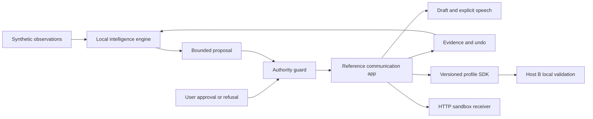

# Implementation evidence and remaining scope

Implementation date: 9 September 2026. Reference: NeuralBridge Intelligence Layer PRD v7.8, especially sections 14–19. The confidential source PDF is not distributed in this repository.

## Capability matrix

| Path | Current implementation | Remaining PRD gate |
| --- | --- | --- |
| Core interaction | Phrase selection/confirmation, free text, draft persistence, explicit speech, stop | Hardware access and participant validation |
| Adaptation | Quality-qualified trials, bounded target/dwell changes, approval/refusal, expiry, undo, fallback, recovery | Persistence across sessions, richer history-aware reasoning and fair policy comparisons |
| M01 EEG fusion | Synthetic synchronized candidate agreement; abstains on disagreement or invalid evidence | Real signal replay/decoder and live EEG |
| M02 physiology | Timestamped synthetic context, quality and missingness in evidence | Context must further qualify cross-channel decisions; no physiological validity established |
| M03 blink | WebM video decoding and pixel-measured synthetic geometry; long/short/no-intent/occluded fixtures | Real human-face models and clinical blink validation |
| M04 speech input | Simulated transcript, editable correction, voice quality observations | ASR optional; stronger reliability orchestration remains |
| M05 language | Actual small statistical bigram model, local training corpus, editable suggestions, quick/story composition | Broader generative quality and 1,000-word bootstrap vocabulary |
| M06 voice | Selectable installed device voices, default fallback | Personal voice asset lifecycle and consented cloning |
| M07 profiles | Persistent loopback HTTP profile service, export/import, two independent browser hosts, conflict/offline/revocation tests | Authenticated cross-device production sync |
| M08 SDK | Browser-compatible ES modules and HTTP SDK, independent Host B UI | Broader conformance suite and real devices |
| M09 care | HTTP sandbox receiver with deduplication, timeout, acknowledgement and completion | Real care integration remains later-stage |
| M10 medication | Fictional reminder, acknowledgement remains distinct from administration | Imported prescribed plans and timeline visualization |
| M11 orders | Installed test order with author/scope/version/expiry/checksum checks; later apply and undo enforce dwell bound | Production signatures; explicit expired-order review UX |
| M12 MI alert | Synthetic candidates reach HTTP sandbox; no-intent/artifacts/low quality rejected | Calibrated live decoder and supervised evaluation |

## Verification

21 automated tests pass across engine, language model and platform contracts. Browser walkthrough verified phrase confirmation, target enlargement to 125%, undo to 100%, and draft preservation. Syntax checks pass. Browser speech API is connected to installed device voices; auditory intelligibility was not independently assessed. Browser also verified 30-frame WebM decoding (400 ms accepted vs 100 ms abstained), HTTP delivery/acknowledgement/completion, and Host B target validation. More extensive browser regression, mobile review, and a recorded walkthrough remain open.

## Architecture

## Next milestone and cost assumptions

Next close remaining software gaps: stronger cross-channel context/voice orchestration, persistent outcome history, expired-order review, 1,000-word vocabulary, recorded walkthrough, and paired policy evaluation. Video fixture decoding is an actual pixel-processing path, not a human face detector. The four generated fixtures use no personal data. Then select one live access integration and agree a supervised evaluation protocol with appropriate experts. No participant benefit can be inferred from this demonstrator.

Current runtime requires no paid API. Engineering labor, supported hardware, specialist evaluation, hosting/security and contingency remain unquoted. No funding amount or runway has been fabricated; founders must supply capacity and obtain quotations before a costed ask is complete.
